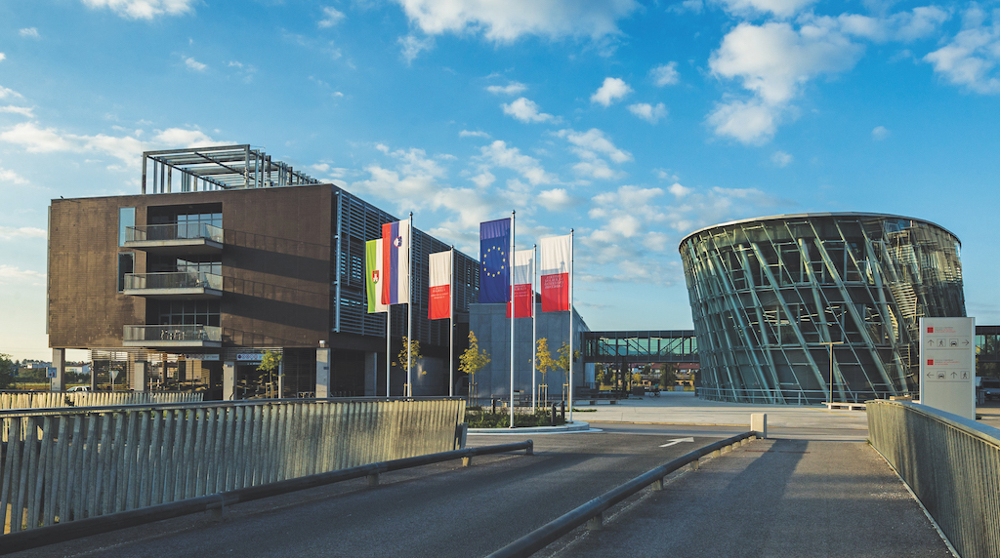

# tpo-group-project

~
*Repository is dedicated to the final project for the undergraduate Software Engineering course at the University of Ljubljana, Faculty of Computer and Information Science (UL FRI).*
~

## Collaborators:
- Kris Petrič
- Amadej Miličev
- Nejc Vene
- Gašper Rifel
- Sašo Primožič
- Matic Zadobovšek

---

## ❗Project Title: {TBD}

### 📝 Project Description: 
- {TBD}

---

### 🚀 Technologies: 
- {TBD}

### 🔖 Repository Structure: 
- {TBD}

### ✅ Installation Guide: 
- {TBD}

---
